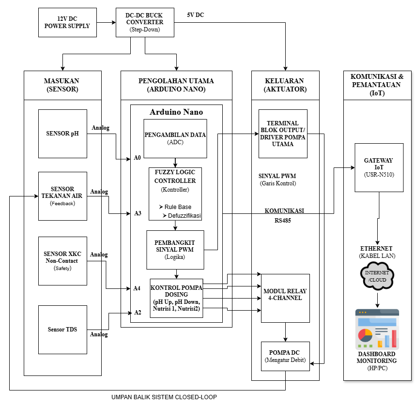
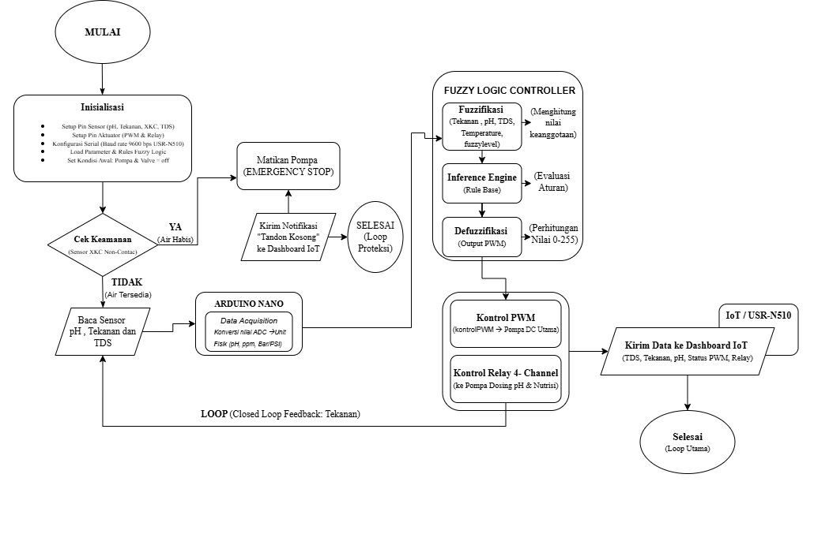

# Dashboard Monitoring Smart Fertigasi - Tugas Akhir

Sistem ini berfungsi untuk memantau parameter air nutrisi tanaman secara real-time dan mengendalikan aktuator secara adaptif menggunakan kecerdasan buatan di sisi lokal panel.

---

## 1. Arsitektur Jaringan IoT (Diagram Blok)

Diagram ini menjelaskan jalur koneksi perangkat keras (*hardware*) fisik yang menghubungkan seluruh sensor di lapangan menuju Cloud Broker HiveMQ hingga data berhasil divisualisasikan pada Web Dashboard.

---

## 2. Alur Logika Pemrograman (Flowchart Sistem)

Sistem ini bekerja secara otomatis menggunakan siklus *closed-loop feedback* dengan sistem proteksi tangki kosong dan kendali adaptif berbasis Logika Fuzzy. Berikut adalah diagram alir (*flowchart*) dari algoritma yang berjalan di dalam Arduino Nano:

### Penjelasan Tahapan Flowchart:

1. **Inisialisasi Sistem:**
   * Konfigurasi pin input/output (I/O) untuk seluruh komponen sensor (pH, TDS, Suhu, Tekanan, XKC) dan aktuator (Relay & PWM Pompa).
   * Inisialisasi komunikasi serial RS485 pada baud rate 9600 bps untuk interkoneksi ke gateway USR-N510.
   * Memuat parameter fungsi keanggotaan (*membership functions*) dan aturan (*rule base*) Logika Fuzzy ke dalam memori Arduino Nano.

2. **Loop Proteksi Keamanan (Emergency Stop):**
   * Sebelum melakukan pembacaan parameter nutrisi, sistem memeriksa status sensor level cairan *XKC Non-Contact* pada tandon reservoir.
   * **Jika Air Habis (YA):** Sistem langsung mematikan seluruh pompa utama secara instan (*Emergency Stop*), mengirimkan notifikasi peringatan `"Tandon Kosong"` ke Dashboard IoT, dan menghentikan proses sementara untuk mengamankan pompa dari kerusakan akibat berjalan tanpa cairan (*dry running*).
   * **Jika Air Tersedia (TIDAK):** Sistem melanjutkan ke tahap akuisisi data.

3. **Data Acquisition (Arduino Nano):**
   * Mengambil data mentah (ADC) dari sirkuit sensor pH, Tekanan, dan TDS.
   * Mengonversi nilai digital tersebut menjadi unit fisik nyata (Nilai pH, PPM untuk kepekatan TDS, dan Bar/PSI untuk Tekanan Pipa).

4. **Fuzzy Logic Controller (FLC):**
   * **Fuzzifikasi:** Mengubah nilai fisik sensor (Tekanan, pH, TDS, Suhu) menjadi nilai linguistik berdasarkan derajat keanggotaan yang telah ditentukan.
   * **Inference Engine:** Mengevaluasi kondisi parameter air nutrisi di dalam reservoir menggunakan basis aturan (*Rule Base*) logika fuzzy.
   * **Defuzzifikasi:** Menghitung kembali output fuzzy menjadi nilai riil biner atau skala analog (`0-255`) untuk menentukan aksi akhir pada aktuator.

5. **Output & Actuator Control:**
   * **Kontrol PWM:** Menyesuaikan laju debit Pompa DC Utama secara adaptif berdasarkan umpan balik (*feedback*) tekanan air di dalam pipa distribusi.
   * **Kontrol Relay 4-Channel:** Mengaktifkan atau mematikan Pompa Dosing penambah cairan *pH Up*, *pH Down*, serta Nutrisi secara presisi sesuai instruksi hasil keputusan kendali Fuzzy.

6. **IoT Data Transmission:**
   * Seluruh parameter sensor beserta status terkini dari aktuator dibungkus ke dalam format string JSON.
   * Data dikirim via jalur serial RS485 menuju Gateway **USR-N510** untuk diteruskan ke broker HiveMQ via kabel Ethernet sehingga grafik pada Web Dashboard ter-update secara otomatis.