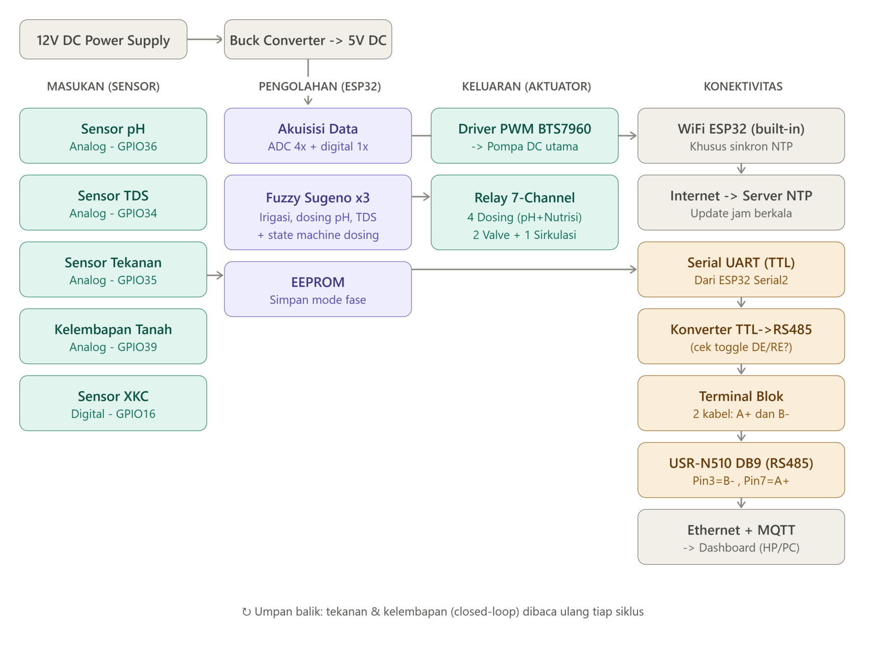
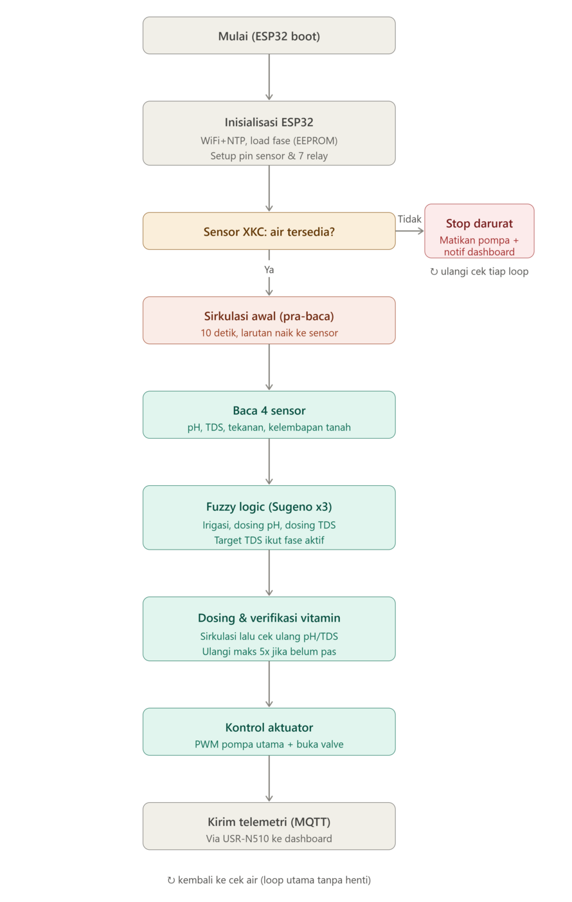
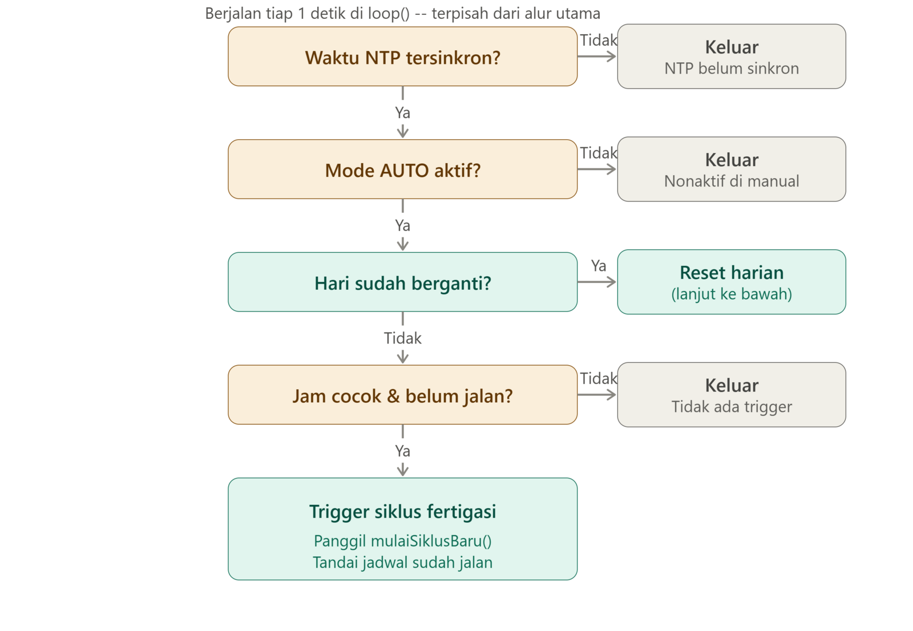
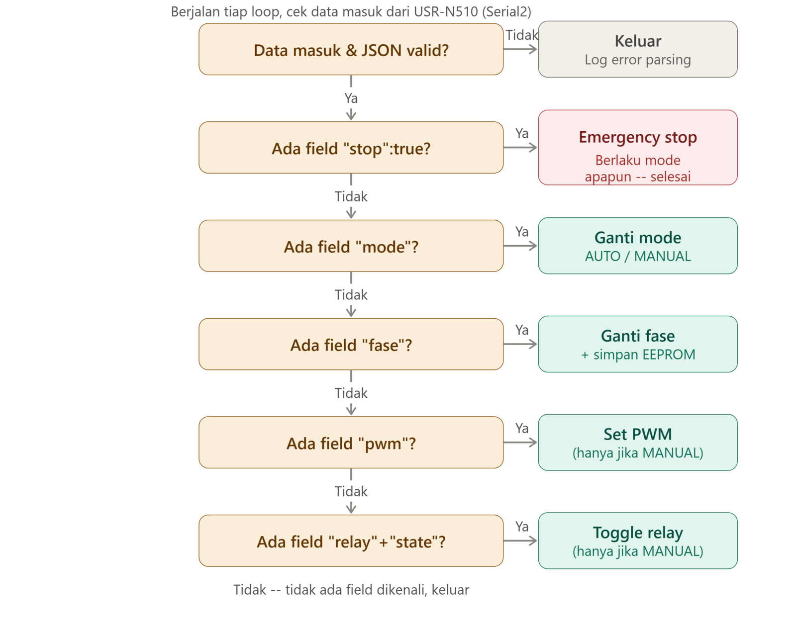

# Dashboard Monitoring Smart Fertigasi — Tugas Akhir

Sistem ini memantau parameter larutan nutrisi tanaman secara *real-time* dan mengendalikan seluruh aktuator (pompa utama, dosing, valve, sirkulasi) secara adaptif menggunakan **ESP32** tunggal dengan tiga modul **Fuzzy Logic Sugeno**, dijembatani ke Web Dashboard via **RS485 (USR-N510) → MQTT (HiveMQ)**.

> **Revisi terbaru:** dokumen ini, kedua diagram, dan halaman *Kontrol Manual* telah disinkronkan ulang dengan firmware v6.7 — termasuk relay 7-channel penuh (sebelumnya baru 4), pemicu jadwal otomatis berbasis NTP, parser perintah dashboard, dan jam sistem *live* di sidebar. Lihat [Catatan Revisi](#catatan-revisi) di bagian akhir.

---

## 1. Ringkasan Arsitektur

Seluruh akuisisi data, logika fuzzy, dan kontrol aktuator dijalankan oleh **satu ESP32** (bukan lagi kombinasi Arduino Nano + ESP8266 seperti draf awal). ESP32 terhubung ke internet hanya untuk sinkronisasi waktu **NTP** (dipakai sebagai pemicu jadwal otomatis), sedangkan pengiriman data ke dashboard dilakukan lewat jalur serial **RS485** menuju gateway **USR-N510** yang meneruskannya ke broker **MQTT** melalui Ethernet.



### Peta Sensor (Masukan)

| Sensor | Jenis | Pin ESP32 |
|---|---|---|
| pH | Analog | GPIO36 |
| TDS | Analog | GPIO34 |
| Tekanan pipa | Analog | GPIO35 |
| Kelembapan tanah | Analog | GPIO39 |
| XKC (level air, non-contact) | Digital | GPIO16 |

### Peta Relay (Keluaran) — 7 Channel

| Relay | Fungsi | Aktif saat |
|---|---|---|
| 1 | Dosing pH UP | Fuzzy AUTO / tombol manual |
| 2 | Dosing pH DOWN | Fuzzy AUTO / tombol manual |
| 3 | Nutrisi A | Fuzzy AUTO / tombol manual |
| 4 | Nutrisi B | Fuzzy AUTO / tombol manual |
| 5 | Valve Air (jalur air utama) | Fase "Kontrol aktuator" (buka valve + PWM pompa utama) |
| 6 | Valve Vitamin (jalur vitamin/nutrisi konsentrat) | Sirkulasi awal (pra-baca) & verifikasi dosing |
| 7 | Sirkulasi Vitamin (pompa diafragma kecil) | Menyirkulasikan larutan vitamin/nutrisi melewati sensor pH & TDS saat pra-baca dan saat verifikasi ulang dosing (maks. 5x) |

Pompa utama sendiri **bukan** relay ON/OFF, melainkan dikendalikan analog lewat **driver PWM BTS7960** (0–255) berdasarkan hasil defuzzifikasi Sugeno untuk irigasi.

### Konektivitas ke Dashboard

```
ESP32 Serial2 (UART TTL)
        ↓
Konverter TTL → RS485
        ↓
Terminal blok (2 kabel: A+ dan B-)
        ↓
USR-N510 DB9  (Pin 3 = B-, Pin 7 = A+)
        ↓
Ethernet + MQTT  →  Dashboard (HP / PC)
```

WiFi bawaan ESP32 **hanya** dipakai untuk sinkronisasi NTP secara berkala — bukan untuk mengirim data sensor, sehingga sistem tetap bisa mengirim telemetri lewat RS485/Ethernet meskipun WiFi lokal di area tandon tidak stabil.

---

## 2. Alur Program Utama (Flowchart)

Loop utama berjalan **tanpa henti** setelah boot dan inisialisasi (WiFi+NTP, muat fase dari EEPROM, setup pin sensor & 7 relay).



Ringkasan tahapan:

1. **Cek sensor XKC** — jika air tidak tersedia, sistem langsung **Stop darurat** (matikan pompa + kirim notifikasi ke dashboard) dan mengulang pengecekan tiap loop hingga air kembali tersedia.
2. **Sirkulasi awal (pra-baca)** — Relay 6 & 7 menyirkulasikan larutan selama ±10 detik agar cairan naik melewati sensor sebelum dibaca, supaya pembacaan pH/TDS akurat.
3. **Baca 4 sensor** — pH, TDS, tekanan, kelembapan tanah.
4. **Fuzzy Logic (Sugeno × 3)** — tiga modul fuzzy independen: **irigasi** (kecepatan PWM pompa utama), **dosing pH**, dan **dosing TDS**. Target TDS pada fuzzy dosing mengikuti **fase aktif** (vegetatif/generatif) yang tersimpan di EEPROM.
5. **Dosing & verifikasi vitamin** — setelah relay dosing menyala sesuai keputusan fuzzy, sistem mensirkulasikan ulang larutan lalu membaca ulang pH/TDS; jika belum sesuai target, proses diulang hingga **maksimal 5 kali**.
6. **Kontrol aktuator** — PWM pompa utama disetel + Relay 5 (valve air) dibuka untuk mengalirkan air ke jalur irigasi, dengan Relay 6 (valve vitamin) mengatur pencampuran vitamin/nutrisi konsentrat sesuai kebutuhan.
7. **Kirim telemetri (MQTT)** — seluruh nilai sensor + status 7 relay + PWM dibungkus JSON dan dikirim via USR-N510 ke dashboard.
8. Kembali ke langkah 1 (*closed-loop*: tekanan & kelembapan tanah selalu dibaca ulang tiap siklus untuk umpan balik).

---

## 3. Pemicu Jadwal Otomatis (NTP)

Selain loop utama di atas, ada **task terpisah yang berjalan tiap 1 detik** di `loop()` untuk memeriksa apakah sudah waktunya menjalankan siklus fertigasi terjadwal:



Urutan pemeriksaan: waktu NTP harus **tersinkron** → mode harus **AUTO** (jadwal otomatis nonaktif total di mode manual) → jika hari sudah berganti maka jadwal harian **direset**, lalu diperiksa apakah jam saat ini **cocok** dengan jadwal dan **belum dijalankan hari ini** → jika ya, panggil `mulaiSiklusBaru()` dan tandai jadwal tersebut sudah jalan agar tidak terpicu berulang dalam menit yang sama.

---

## 4. Menerima Perintah dari Dashboard

ESP32 juga membaca `Serial2` tiap loop untuk menerima perintah balik dari dashboard (dikirim dashboard → MQTT → USR-N510 → RS485 → ESP32):



Field JSON yang dikenali (diperiksa berurutan, berhenti begitu satu field cocok):

| Field | Efek | Berlaku di mode |
|---|---|---|
| `"stop": true` | **Emergency stop** — mematikan seluruh pompa & relay | Semua mode |
| `"mode"` | Ganti mode `AUTO` / `MANUAL` | Semua mode |
| `"fase"` | Ganti fase `vegetatif` / `generatif` + simpan ke EEPROM | Semua mode |
| `"pwm"` | Set kecepatan PWM pompa utama secara langsung | Hanya MANUAL |
| `"relay"` + `"state"` | Toggle salah satu dari 7 relay | Hanya MANUAL |

Jika JSON tidak valid atau tidak ada field yang dikenali, ESP32 mencatat log error/keluar tanpa mengubah state apa pun (fail-safe).

---

## 5. Mode Sistem & Fase Tanaman

- **Mode Otomatis (AUTO):** seluruh keputusan pompa & dosing ditentukan oleh Fuzzy Sugeno; jadwal NTP otomatis aktif.
- **Mode Manual:** fuzzy logic dinonaktifkan sementara; PWM pompa utama dan ke-7 relay dikendalikan langsung dari halaman **Kontrol Manual** di dashboard. Jadwal otomatis tidak akan memicu siklus baru selama mode manual aktif.
- **Fase Vegetatif / Generatif:** menentukan target pH & TDS yang dipakai fuzzy dosing (target TDS generatif lebih tinggi, mengikuti kebutuhan tanaman saat berbunga/berbuah). Perubahan fase disimpan ke EEPROM agar tidak hilang saat perangkat mati/restart.

---

## 6. Halaman Dashboard

| Halaman | Fungsi |
|---|---|
| `index.html` — Dashboard | Monitoring real-time (pH, TDS, suhu, tekanan, kelembapan tanah), grafik tren, derajat keanggotaan fuzzy, status ke-7 relay, PWM pompa utama, level tangki |
| `kontrol.html` — Kontrol Manual | Pilih mode AUTO/Manual, pilih fase vegetatif/generatif, slider PWM manual, kontrol ON/OFF ke-7 relay (4 dosing + 2 valve + 1 sirkulasi vitamin), tombol berhenti darurat |
| `kalibrasi.html` — Kalibrasi Sensor | Kirim offset/target kalibrasi pH & TDS ke EEPROM ESP32 |
| `riwayat.html` — Riwayat Data | Log historis data sensor & status pompa |

Sidebar setiap halaman menampilkan **jam sistem berjalan (live clock)** yang berdetak tiap detik dari jam lokal browser, terpisah dari label **"Terakhir Diperbarui"** di header dashboard yang hanya berubah saat ada payload MQTT baru masuk dari perangkat.

### Topik MQTT (broker HiveMQ publik, WebSocket port 8000, namespace `irigasi/drip/*`)

| Topik | Arah | Isi |
|---|---|---|
| `irigasi/drip/sensor` | ESP32 → Dashboard | Telemetri sensor + status 7 relay + PWM |
| `irigasi/drip/kontrol/mode` | Dashboard → ESP32 | `{ mode: "auto" \| "manual" }` |
| `irigasi/drip/kontrol/fase` | Dashboard → ESP32 | `{ fase: "vegetatif" \| "generatif" }` |
| `irigasi/drip/kontrol/pwm` | Dashboard → ESP32 | `{ pwm: 0-255 }` (manual saja) |
| `irigasi/drip/kontrol/relay` | Dashboard → ESP32 | `{ relay: "phup"\|"phdown"\|"nut1"\|"nut2"\|"valve1"\|"valve2"\|"vitamin", state: 0\|1 }` (manual saja) |
| `irigasi/drip/kontrol/emergency` | Dashboard → ESP32 | `{ stop: true }` |
| `irigasi/drip/cal/ph` | Dashboard → ESP32 | `{ target, offset }` |
| `irigasi/drip/cal/tds` | Dashboard → ESP32 | `{ target, factor }` |

---

## 7. Struktur Proyek

```
Dashboard_TA/
├── index.html            Dashboard monitoring utama
├── kontrol.html           Kontrol manual (mode, fase, PWM, 7 relay, emergency stop)
├── kalibrasi.html         Kalibrasi sensor pH & TDS
├── riwayat.html           Riwayat/log data historis
├── Components/
│   ├── Sidebar.html       Sidebar + jam sistem (fallback fetch)
│   ├── ControlPanel.html  Komponen panel status 7 relay + PWM
│   └── MetricCard.html    Komponen kartu metrik sensor
├── assets/
│   ├── css/style.css      Utility & animasi kustom
│   ├── js/
│   │   ├── connection.js  Koneksi MQTT (Paho) + publish/subscribe
│   │   ├── main.js        Parser data real-time, live clock, UI relay/PWM
│   │   └── app-chart.js   Grafik tren pH/TDS (Chart.js)
│   └── img/
│       ├── diagramblok.png        Diagram blok arsitektur (v3)
│       ├── flowchart.png          Alur program utama ESP32
│       ├── flowchart-jadwal.png   Pemicu jadwal otomatis (NTP)
│       └── flowchart-perintah.png Parser perintah dari dashboard
└── README.md
```

---

## Catatan Revisi

- Diagram blok & seluruh flowchart digambar ulang agar sesuai firmware v6.7 (ESP32 tunggal, Fuzzy Sugeno ×3, EEPROM fase, relay 7-channel).
- Halaman **Kontrol Manual** dan panel status di **Dashboard** ditambah kontrol/indikator untuk **Relay 5** (valve air), **Relay 6** (valve vitamin), dan **Relay 7** (sirkulasi vitamin, pompa diafragma kecil) — sebelumnya hanya 4 relay dosing yang tersedia.
- Ditambahkan **jam sistem live** (`#live-clock`) di sidebar seluruh halaman, berjalan independen dari timestamp "Terakhir Diperbarui" berbasis MQTT.
- Seluruh sisa referensi "Arduino Nano" / "ESP8266" pada judul sidebar dan teks penjelasan diperbarui menjadi **ESP32** agar konsisten dengan diagram blok terbaru.
